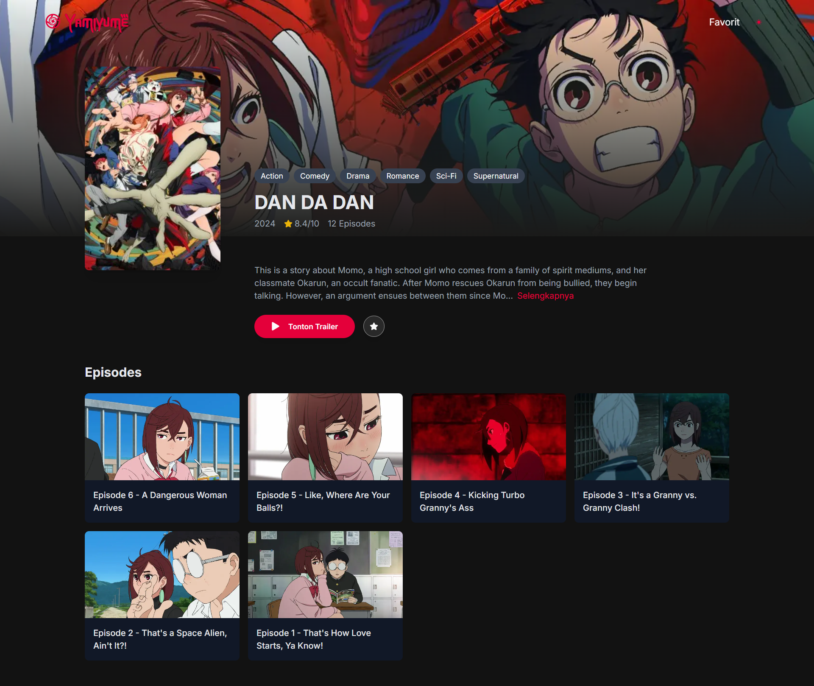
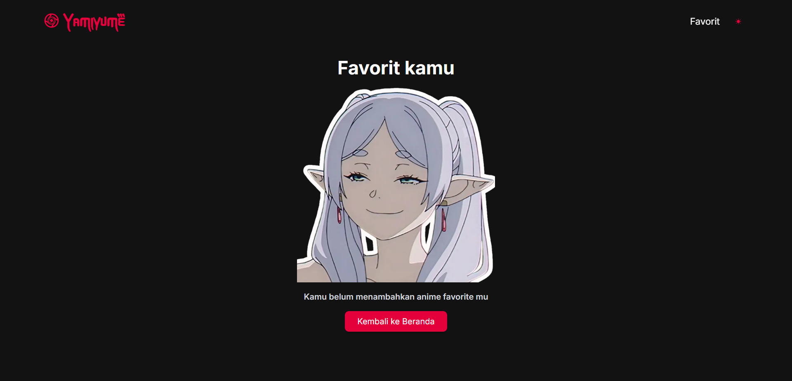

[](https://yamiyume.vercel.app/)

# Yamiyume - Anime List Application

This project is a web application designed for anime enthusiasts to explore, favorite, and manage their anime collections. Built using **Next.js**, **TypeScript**, **Tailwind CSS**, and the [**AniList**](https://anilist.co/), the application provides features like an anime catalog, detailed anime pages, episode browsing, and a favorites section for personalized tracking.

🌍 See hosted project on Vercel: [Yamiyume](https://yamiyume.vercel.app/)

# Home Page

[](https://yamiyume.vercel.app/)

## Features

- **Anime Catalog**: Browse a wide selection of anime, with search, filter, and pagination options.
- **Anime Detail Page**: View detailed information about each anime, including title, synopsis, genres, and episodes.
- **Favorites Management**: Add and remove anime from a personalized favorites list.
- **Trailer Modal**: Watch anime trailers in a modal window without leaving the application.
- **Episode Browsing**: Explore episodes with thumbnails, each linking to available streaming sources.
- **Responsive UI**: A modern and clean design that adapts to various screen sizes, inspired by popular streaming platforms.

## Technologies Used

- **Next.js**: Framework for server-side rendering and optimized performance.
- **TypeScript**: Provides static typing for improved development and maintainability.
- **Tailwind CSS**: Utility-first CSS framework for quick, responsive styling.
- **AniList API**: Provides anime data and episode details using GraphQL.
- **Redux**: Manages global state, including favorites and UI state.

# Detail Page

[](https://yamiyume.vercel.app/anime/1)

## Installation

To run the project locally, follow these steps:

1. Clone the repository:

   ```bash
   git clone https://github.com/dimasrdika/Yamiyume.git
   ```

2. Navigate to the project directory:

   ```bash
   cd Yamiyume
   ```

3. Install dependencies:

- If you're using npm:

  ```bash
  npm install
  ```

- If you're using yarn:
  ```bash
  yarn
  ```

4. Start the development server:

   ```bash
   npm run dev
   ```

5. Open your browser and navigate to http://localhost:3000.

# Favorite Page

[](https://yamiyume.vercel.app/anime/1)

## Author

- [Dimas Rachmadika](https://github.com/dimasrdika)

## Acknowledgments

- [AniList API](https://anilist.co/)
- [AniList GraphQL API](https://graphql.anilist.co/)
- [Next.js](https://nextjs.org/)
- [Tailwind CSS](https://tailwindcss.com/)
- [TypeScript](https://www.typescriptlang.org/)
- [Redux Toolkit](https://redux-toolkit.js.org/)
